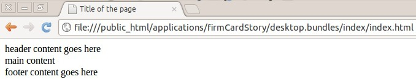
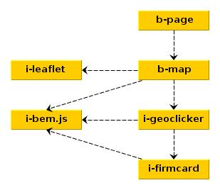

Сегодня мы рассмотрим пример реализации несложного картографического сервиса по [БЭМ-методологии](http://ru.bem.info/).

Интро
=============

Менеджер:
Хочу чтоб карта была, я в здание кликал, у меня балун появлялся и в нём информация об организации.

Программист:
* Сделать html-страницу;
* Использовать библиотеку [LeafLet](https://github.com/CloudMade/Leaflet);
* Написать переиспользуемый плагин отображения карточки фирмы;
* Сослаться на слово "переиспользуемый" и попробовать это сделать по БЭМ-методологии.

Переиспользуемый плагин?
* Отловить клик по карте;
* Отправить запрос к [геокодеру 2GIS](http://api.2gis.ru/doc/geo/search/), который вернет данные фирмы по координатам;
* Показать балун и с нужной информацией.

Назовем наш проект firmCardStory.

Инициализация проекта
=============

Инициализируем заготовку проекта:

    git clone https://github.com/bem/project-stub.git firmCardStory
    cd firmCardStory
    npm install

Выполним сборку проекта:

    $ ./node_modules/bem/bin/bem make

Откроем в браузере файл desktop.bundles/index/index.html и посмотрим что страница собралась:

Для разработки также удобно использовать [bem server](http://ru.bem.info/tools/bem/commands/), который будет выполнять сборку проекта по запросу от браузера, для этого нужно запустить его находясь в папке проекта:

    $ ./node_modules/bem/bin/bem server

И зайти в браузере по адресу: http://localhost:8080/desktop.bundles/index

Макет страницы
=============

Изменим структуру страницы, заполнив файл desktop.bundles/index/index.bemjson.js следующим содержимым:

    ({
        block: 'b-page',
        title: 'Карта Новосибирска',
        head: [
           { elem: 'css', url: '_index.css' },
           { elem: 'css', url: '_index', ie: true },
           { elem: 'js', url: 'http://yandex.st/jquery/1.8.2/jquery.min.js' },
           { elem: 'js', url: '_index.js' }
        ],
        content: [
            { block: 'b-map' }
        ]
    })

В данном файле мы описали, что:
* Для формирования страницы используется блок [b-page](https://github.com/bem/bem-bl/tree/master/blocks-desktop/b-page) библиотеки [bem-bl](http://bem.github.com/bem-bl/index.ru.html);
* Заголовок страницы - Карта Новосибирска;
* На страницу будут подключены css и js файлы;
* Контент страницы будет формироваться из блока b-map.

Так как файл _index.ie.css нам нужен только для IE, мы указали свойство ie в true. Узнать о существовании такого свойства можно заглянув в код [bemhtml-шаблона](https://github.com/bem/bem-bl/blob/master/blocks-desktop/b-page/b-page.bemhtml) блока b-page.

Подробнее о bemhtml-шаблонизаторе можно почитать [в документации](http://bem.github.com/bem-bl/pages/bemhtml-syntax/bemhtml-syntax.ru.html).

Блок i-firmcard
=============

Нам нужен блок, в зону ответственности которого входит:
* Принять на вход данные о фирме в JSON-формате;
* Вернуть красиво сверстанный html-код карточки.

Создадим этот блок на уровне переопределения desktop.blocks в технологии js:

    $ ./node_modules/bem/bin/bem create block i-firmcard -l desktop.blocks -T js

Опишем файл desktop.blocks/i-firmcard/i-firmcard.js:

    BEM.decl ('i-firmcard', {}, {
        /**
        * @param {Object} data Firm info
        * @return {String}
        */
        getFormattedText: function (data) {
           var content = '<b>Информация:</b> ';
           content += 'Адрес: ' + data.name + ' ';
           content += 'Тип: ' + data.attributes.purpose;
           return content;
        }
    });

Для описания карточки мы воспользовались библиотекой i-bem.js. Подробнее о данной библиотеке можно узнать из доклада Владимира Варанкина "[Зачем мы написали js-фреймворк?](http://video.yandex.ua/users/ya-events/view/880/#hq)".

На самом деле, в реальном приложении карточка может быть более функциональна, например она может содержать сложную верстку, просчитывать и отображать время до закрытия организации, отлавливать клики на себе и разворачиваться с детальной информацией и т.д.

В таком случае, из простого хелпера возвращающего отформатированный текст, идею карточки можно развить в самодостаточный независимый блок приложения с множеством элементов и модификаторов в разных технологиях (css, js, bemhtml), который принимает на вход DOM-элемент и JSON с "сырыми" данными, разворачивается в этом DOM-элементе и начинает функционировать.

Блок i-geoclicker
=============

Кроме самого блока карточки организации нам потребуется плагин к LeafLet-у, который будет отлавливать клик по карте и показывать карточку в балуне.

Создадим его:

    $ ./node_modules/bem/bin/bem create block i-geoclicker -l desktop.blocks -T js

И опишем поведение блока в файле desktop.blocks/i-geoclicker/i-geoclicker.js:

    BEM.decl ('i-geoclicker', {}, {
        /**
         * @type {L.Map}
         */
        _map: null,

        /**
         * @type {L.LatLng}
         */
        _lastLatLng: null,

        /**
         * @param {L.Map} map
         */
        addTo: function (map) {
           this._map = map;
           this._map.on({
               'click': this.getGeoObject
           }, this);
        },

        /**
         * @param {L.MouseEvent} mouseEvent
         */
        getGeoObject: function (mouseEvent) {
           this._lastLatLng = mouseEvent.latlng;
           $.ajax({
               url: 'http://catalog.api.2gis.ru/geo/search',
               data: {
                   q: mouseEvent.latlng.lng + ',' + mouseEvent.latlng.lat,
                   key: this.API_KEY,
                   version: this.API_VERSION,
                   output: 'jsonp',
                   types: 'house,sight,station_platform'
              },
              dataType: 'jsonp',
              success: this.showPopup,
              context: this
          });
        },

        /**
         * @param {Object} data
         */
        showPopup: function (data) {
           if(data.result !== undefined) {
               var content = BEM.blocks['i-firmcard'].getFormattedText(data.result[0]);
               var popup = L.popup()
                   .setLatLng(this._lastLatLng)
                   .setContent(content)
                   .openOn(this._map);
           }
        },

        /**
         * @type {String}
         */
        API_KEY: 'rujrdp3400',

        /**
         * @type {Number}
         */
        API_VERSION: 1.3
    });

Как видим, блок довольно простой и состоит всего из 3-х методов:
* addTo - обработчик добавления плагина на карту LeafLet, в котором происходит подписка на событие клика по карте;
* getGeoObject - метод для получения данных из геокодера 2GIS;
* showPopup - метод для отображения балуна с информацией об организации.

Блок b-map
=============

Для того, чтобы карта отобразилась на странице, её нужно инициализировать. За инициализацию карты с написанным нами плагином будет отвечать блок b-map, создадим его:

    $ ./node_modules/bem/bin/bem create block b-map -l desktop.blocks -T js -T css -T bemhtml

Опишем файл desktop.blocks/b-map/b-map.js:

    BEM.DOM.decl ('b-map',
    {
        onSetMod: {
          'js': function() {
               var map = L.map(this.domElem.get(0)).setView([54.98, 82.89], 16);
               var geoclicker = BEM.blocks['i-geoclicker'];
               L.tileLayer('http://{s}.tile.cloudmade.com/BC9A493B41014CAABB98F0471D759707/997/256/{z}/{x}/{y}.png').addTo(map);
               geoclicker.addTo(map);
           }
        }
    },
    {});

Опишем файл desktop.blocks/b-map/b-map.css:

    .b-map {
        height: 600px;
    }

И desktop.blocks/b-map/b-map.bemhtml:

    block b-map {
        js: true
    }

Блок i-leaflet
=============

Конечно же, без самой библиотеки LeafLet карта не заработает, создадим блок библиотеки с соответствующими технологиями:

    $ ./node_modules/bem/bin/bem create block i-leaflet -l desktop.blocks -T js -T css -T ie.css

Переписывать чужую библиотеку в БЭМ-терминах — не самая благодарная работа, потому просто скопируем содержимое [dist-файлов](https://github.com/CloudMade/Leaflet/tree/master/dist) в соответствующие файлы нашего блока, а картинки положим в папку i-leaflet/images.

Зависимости
=============

На данный момент у нас имеется такая цепочка зависимостей между блоками:

Эти зависимости нужно где-то описать. Описание зависимостей производится с помощью файлов deps.js. Каждый блок должен сам знать, что ему нужно для полноценной работы.

Файл зависимостей для блока b-page уже есть, создадим такие же файлы для других блоков:

    $ ./node_modules/bem/bin/bem create block i-firmcard -l desktop.blocks -T deps.js
    $ ./node_modules/bem/bin/bem create block i-geoclicker -l desktop.blocks -T deps.js
    $ ./node_modules/bem/bin/bem create block b-map -l desktop.blocks -T deps.js

Заполним файл desktop.blocks/b-page/b-page.deps.js:

    ({
        mustDeps: [{
           block: 'i-bem',
           elem: 'dom',
           mods: { init: 'auto' }
        }]
    })

Заполним файл desktop.blocks/i-firmcard/i-firmcard.deps.js:

    ({
        mustDeps: [{
            "block": "i-bem",
            "elem": "dom"
        }]
    })

Заполним файл desktop.blocks/i-geoclicker/i-geoclicker.deps.js:

    ({
        mustDeps: [{
            "block": 'i-firmcard'
        },
        {
           "block": "i-bem",
           "elem": "dom"
        }]
    })

Заполним файл desktop.blocks/b-map/b-map.deps.js:

    ({
        mustDeps: [{
            "block": 'i-leaflet'
        },
        {
            "block": 'i-geoclicker'
        },
        {

           "block": "i-bem",
           "elem": "dom"
        }]
    })

Сборка
=============

Выполним сборку проекта:

    $ ./node_modules/bem/bin/bem make

Откроем файл desktop.bundles/index/index.html в браузере и посмотрим на результат работы нашего приложения:

Приложение готово к работе. Теперь при клике в каждое здание мы получим краткую информацию о нем.

<!--(Begin) Article author block-->

    

        
    

    

        

             Андрей Геоня,
        

        

            Ведущий веб-разработчик, компания "2GIS"
        

        

             <a class="article-author__social-icon b-link" target="_blank" href="http://twitter.com/AndreyGeonya">twitter.com/AndreyGeonya</a>
        

        

             <a class="article-author__social-icon b-link" target="_blank" href="http://github.com/AndreyGeonya">github.com/AndreyGeonya</a>
        

    

<!--(End) Article author block-->

Код приложения доступен по адресу:
[https://github.com/AndreyGeonya/firmCardStory](https://github.com/AndreyGeonya/firmCardStory)